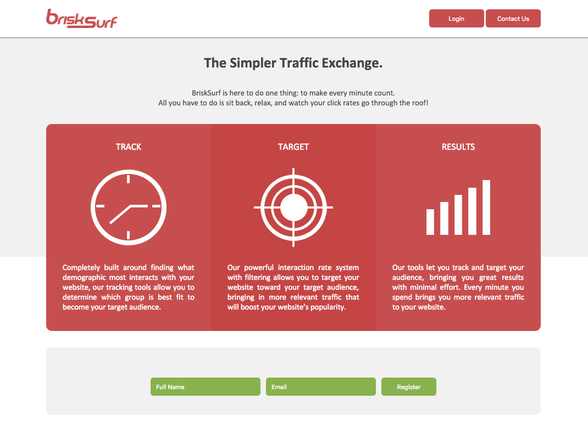
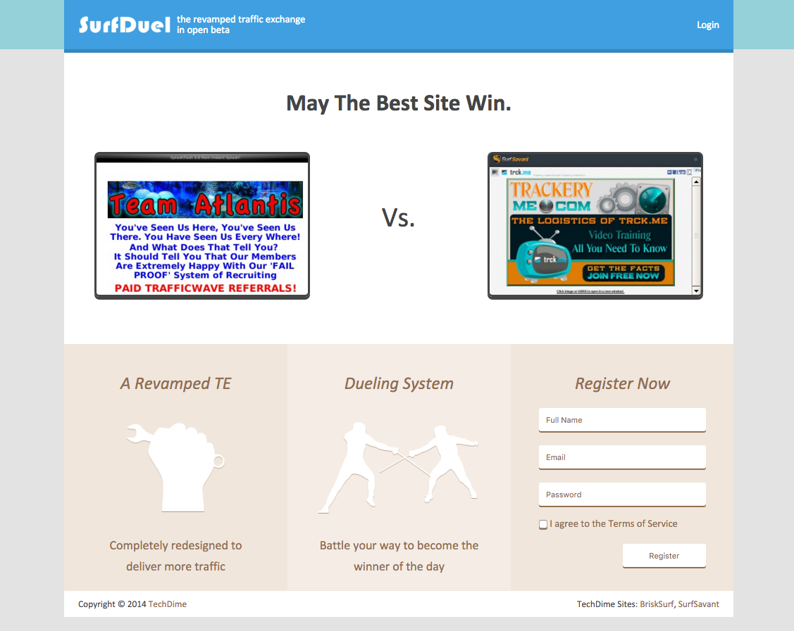
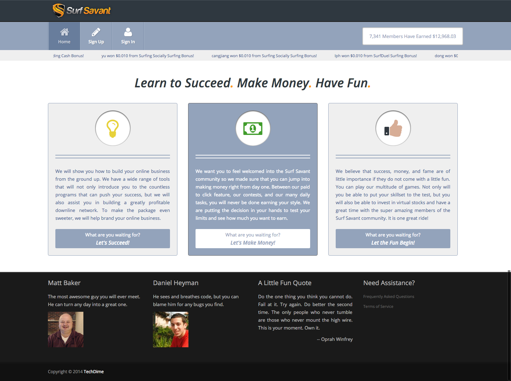
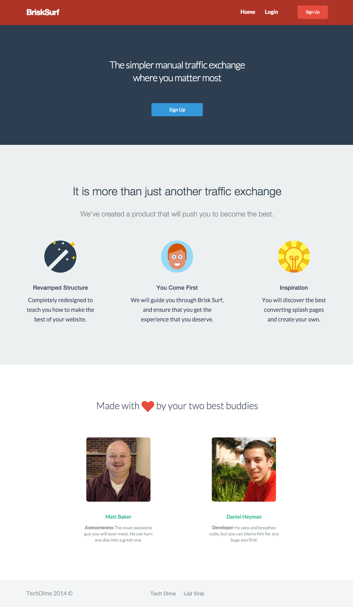

All the following packages were part of the inital TechDime projects in the traffic exchange niche, and were built at the age of 17 in 2013. They generated a gross income of around $30,000 through premium subscriptions before being shut down for focus on school.

BriskSurf focused on simplicity.
SurfDuel focused on entertainment.
SurfSavant focused on user branding.
BriskSurf 2.0 focused on personalization and user-tracking.

## BriskSurf

The first program to launch as part of TechDime. It is a traffic exchange that brought simplicity to the niche. A traffic exchange's purpose is to provide advertisements for a website by having people willingfully look at it in exchange for viewing themselves. In essence, I view your website in exchange for you to view mine. Unlike the other exchange providers in the niche, BriskSurf was the first to provide simplicity and better usability. 

Some additions include being able to target a specific group of users by age, gender, location, and more. Another is the simplicity in viewing other websites. In other exchanges, there would be a big bar at the top with a counter and a next button. BriskSurf looked to remove that by creating floating buttons in the corners of the page, over the frame itself. This gave a lot more space for the actual website to be displayed

## SurfDuel

This program is also a traffic exchange, however it introduced a unique concept that made it more fun. Two websites would be displayed at a time, and the user would have to choose which one they liked better. It was a duel. Throughout the day, websites that were liked more often had a higher chance of being displayed. This brought the interesting websites out and gave the website owners a chance to improve their content as the duels would reset every day at midnight.

## SurfSavant

This program was built upon tutorials, the community, and fun interactive features. It taught users how to be successful in the traffic exchange niche. Some features included a community contributed tutorial section, a stocks game where users could invest coins in the traffic exchanges and would earn or lose based on the traffic exchange's actual success, customizable branding pages, a branding game where users could earn based on their ability to memorize the names of people when only given their picture, and so forth. 

## BriskSurf 2.0 (Unfinished)

BriskSurf 2.0 had the goal of tracking user movements throughout the traffic exchange and provide more relevant information, however the project stopped at around 80% completion. It was largely based on MongoDB and Laravel with the purpose of tracking users and providing them with relevant information and websites. User's website preferences were slowly analyzed and more relevant ones were shown based on users with similar preferences. 

In addition, every action that a user would take would be recorded to the document-based database. With this, in the administration panel, the admin could set up lists such as all the users who upgraded to premium but havn't logged in recently, the users that viewed the upgrade page for a couple minutes but didn't upgrade, or users who referred over 20 other users. With this information, it was possible to set up automatic email lists, change the content shown on the website, or automatically give the user a special item or deal.

